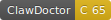

# 🦞 ClawDoc

> Keep your lobster healthy. Health diagnostics for OpenClaw agents.


## Quick Start

```bash
npx clawdoc checkup
```

One command. Zero config. Full health report for your OpenClaw agent.

## Features

- **6 Diagnostic Departments**: System Vitals, Skill & Tool, Memory, Behavior, Cost, Security
- **43 Disease Definitions**: From Token Obesity to Death Loops
- **LLM-Powered Analysis**: Deep diagnosis with causal chain detection
- **Auto-Fix**: `--auto-fix` automatically applies low-risk prescriptions
- **CI Integration**: `--fail-on critical` for your CI pipeline
- **Web Dashboard**: `clawdoc dashboard` for visual health monitoring
- **Quality Badge**: Show your agent's health score in your README
- **Plugin System**: Write custom disease rules and share them

## Commands

| Command | Description |
|---------|-------------|
| `clawdoc checkup` | Full health checkup |
| `clawdoc checkup --fail-on critical` | CI mode — exit 1 on critical issues |
| `clawdoc checkup --auto-fix` | Auto-apply low-risk prescriptions |
| `clawdoc rx list` | View pending prescriptions |
| `clawdoc rx apply <id>` | Apply a prescription |
| `clawdoc rx rollback <id>` | Rollback an applied prescription |
| `clawdoc dashboard` | Start web dashboard |
| `clawdoc badge` | Generate health score badge |
| `clawdoc config show` | View configuration |

## Badge

Add a health score badge to your README:

```bash
clawdoc badge --output badge.svg
```

Then in your README:
```markdown

```

## CI Setup

### GitHub Actions

```yaml
- name: Agent Health Check
  run: npx clawdoc checkup --fail-on critical --no-llm
```

## Plugins

Create custom disease rules:

```bash
npm init clawdoc-plugin-my-rules
```

See [Plugin Authoring Guide](docs/plugin-authoring.md).

## Configuration

```bash
clawdoc config init    # create ~/.clawdoc/config.json
clawdoc config show    # view current config
```

## Design

See [Design Specification](docs/2026-03-17-clawdoc-design.md).

## License

MIT
